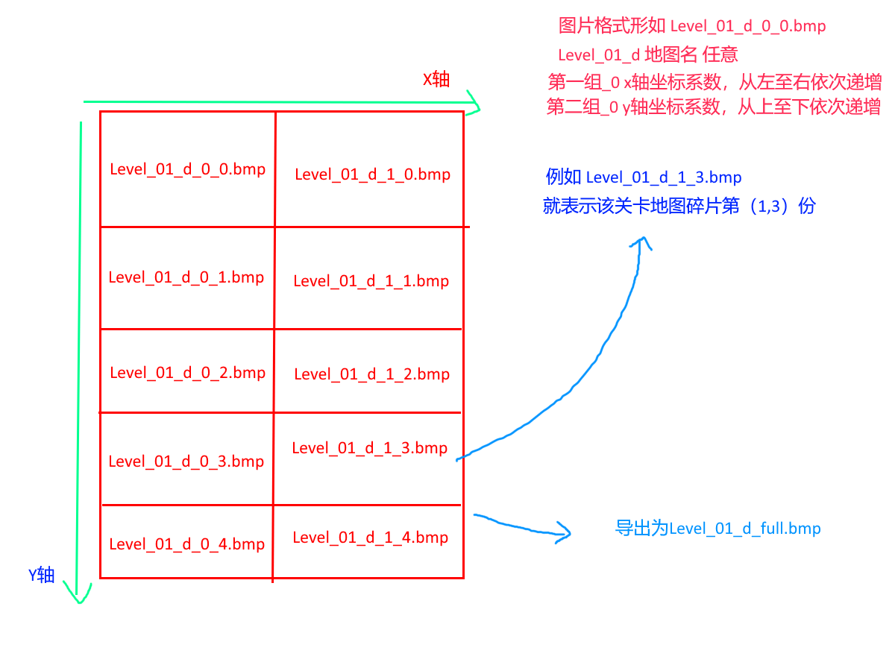
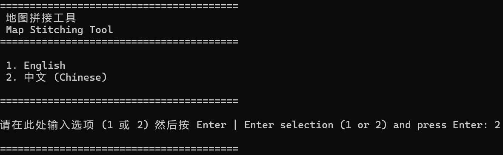
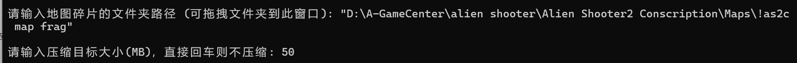
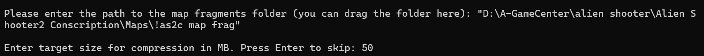

# AS2 Map Stitcher Tool

这是一个轻量级工具，旨在帮助您将《孤胆枪手2》（Alien Shooter 2）系列地图编辑器导出的地图碎片拼接成一张完整的图片，并提供可选的压缩功能。

This is a lightweight tool designed to help you stitch the map fragments exported from the Alien Shooter 2 series map editor into a single, complete image, with an optional compression feature.

## 语言 | Language

- [**简体中文**](#简体中文)
- [**English**](#English)

---

## 简体中文

### 功能简介

这个工具能帮你将AS2系列地图编辑器导出的地图碎片，拼接成一个完整的大图，并可进行高质量的压缩，以大幅减小文件体积。

大致原理如下图所示：

### 1. 获取地图碎片

1. 用地图编辑器打开地图，在菜单栏选择 **File -> Save As AllMapFile**。这会自动在地图文件所在目录生成大量的地图碎片文件。

    > **注意**：此功能在原版 AS2 原版 地图编辑器中可能无法使用，推荐使用 AS2R AS2C的编辑器

2. 为了使导出的地图看起来干净整洁，建议在导出前做以下设置:

    - 在选项栏 **Option -> Gamma Off**，关闭地图的动态光照效果。
    - 在编辑器配置文件 mapeditor.cfg 中设置 DebugMode=1，然后在编辑器中按 **Shift + L** 快捷键，关闭所有物件的发光效果。
    - 使用 **Ctrl + H** 快捷键隐藏以下类型的物件（隐藏哪些完全取决于您的需求）：
        - 地图遮罩: 1127, 1710, 1711, 1521, 1212
        - 空气墙 (碰撞体): 630, 631, 632, 633, 634, 635, 2648, 2706, 1799
        - 雾气效果: 1306

3. 另外需要注意的是，导出的地图碎片尺寸与您在编辑器中设置的屏幕分辨率有关。

### 2. 进行拼接与压缩

1. 双击 **run_app.bat** 启动程序，并根据提示选择语言。

    

2. 输入包含地图碎片的文件夹路径。最简单的方式是**直接将目标文件夹拖拽到命令行窗口中**，然后按 Enter。

3. **可选**：输入压缩后的目标文件大小（单位为 MB）。**强烈推荐**此步骤，因为拼接后的原图可能会非常巨大（超过 500MB）。压缩可以在几乎不损失清晰度的情况下，将文件大小降低 90% 以上。

    

### 版本记录

| 版本号 | 日期       | 更新内容摘要 |
| ------ | ---------- | ------------ |
| v1.0.0 | 2025-08-27 | 初始版本发布 |

------

## English

### Introduction

This tool allows you to take map fragments exported from the AS2 series map editor, stitch them into a single large image, and apply high-quality compression to significantly reduce the file size.

The general principle is illustrated in the image below:

### 1. Exporting Map Fragments

1. Open your map in the map editor, and in the menu bar, select **File -> Save As AllMapFile**. This will automatically generate numerous map fragment files in the same directory as your map file.

    > **Note**: This feature may not be available in the original AS2 map editor. It is recommended to use AS2R or AS2C map editor

2. To ensure the exported map looks clean, it's recommended to apply the following settings before exporting:

    - In the options bar, select **Option -> Gamma Off** to disable dynamic map lighting.
    - In the editor's configuration file mapeditor.cfg, set DebugMode=1. Then, inside the editor, press the **Shift + L** shortcut to disable the glow effect on all objects.
    - Use the **Ctrl + H** shortcut to hide the following object types (what you hide is entirely up to you):
        - Map Masks/Overlays: 1127, 1710, 1711, 1521, 1212
        - Invisible Walls (Collision): 630, 631, 632, 633, 634, 635, 2648, 2706, 1799
        - Fog Effects: 1306

3. Additionally, please note that the dimensions of the exported map fragments are dependent on the screen resolution you have set within the editor.

### 2. Stitching and Compressing

1. Double-click **run_app.bat** to start the program and select your preferred language.

    

2. Enter the path to the folder containing the map fragments. The easiest way is to **drag and drop the folder directly into the command prompt window**, then press Enter.

3. **Optional**: Enter a target file size in Megabytes (MB) for compression. This step is **highly recommended**, as the original stitched image can be enormous (often exceeding 500 MB). Compression can reduce the file size by over 90% with minimal loss of clarity.

    

### Changelog

| Version | Date       | Changes         |
| ------- | ---------- | --------------- |
| v1.0.0  | 2025-08-27 | Initial release |